# BAMazon-CLI
 
Title: BAMazon-CLI 
Developer: Kevin Flerlage 
Deployment Date: 11/25/18 
For: Northwestern Coding Bootcamp 

## **Description**

This is a mock up Amazon webstore/warehouse command line app. There are 3 separate files which the user can run from Node, each detailed below. Each file has different permissions and is intended to be used by a different user, a customer, manager or supervisor. 

The readme is broken up into the categories as detailed below. It will go over each aspect of the application and highlight where user input is validated. 

- BAMazonCustomer
  - Customer App allows the user can see the items currently listed in the store and purchase them if desired
- BAMazonManager
  - View Products for Sale
  - View Low Inventory Levels
    - Displays any product with fewer than 5 items remaining in store
  - Add to Inventory
    - Allows the user to add to the stock of a product in the store
  - Add New Product
    - Allows the user to add new products to the store
- BAMazon Supervisor
  - Add New Department
    - Allows the user to add new departments to the database
  - View Sales By Department
    - Allows the user to view the sales, overhead cost and profit of each department

## **Database**

The inventory in this mock up webstore is run with mySQL. Most of the interaction is driven from the products table in the database. Product data such as: id number, name, department, price, stock amount and value of the sold amount is stored here. The ID number is the primary key for this, and is automatically generated. 

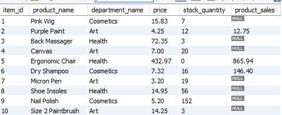 

The departments table is only used within the supervisor app. It is used in determining how profitable each department has been, if at all. In future updates, the department table will feed the manager app which would allow them to add new products to departments that have recently been added by the supervisor. 

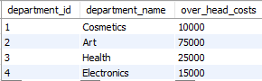 

## **BAMazon Customer**

As a customer in this app the user only has access to view the products currently listed in the webstore and select one to purchase based off the ID of the item. 

On start the app displays a list of items which are currently in the products database. Customers then have the option to pick the item they would like to purchase by entering the product ID. 

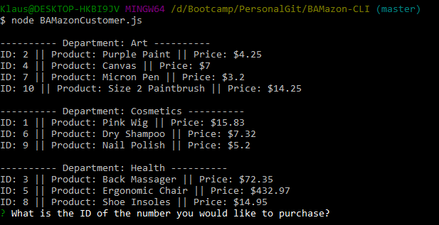 

This app is designed to take ID as a number is much easier to validate than a string. If a customer enters an ID to purchase that is not valid (either not a number or an ID which is greater than the largest ID) then the app will prompt the customer to enter an ID until it is valid. 

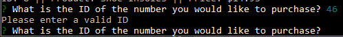 

After inputting a valid ID, the app asks for a quantity the user would like to purchase. 

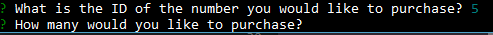 

As with the IDs, the quantity is validated both with the amount and if the user inputted a number. If the user requests an amount which exceeds the current stock of the warehouse, then the app prompts them the current stock and prompts them to request a different quantity. 

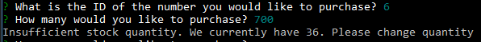 

Additionally, if the warehouse is currently out of stock, a message is displayed indicating this. 

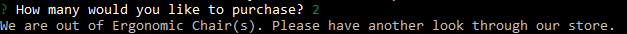 

After the user selects an ID which is valid, and an amount which is currently in stock, the database is updated with the product as being sold. The user is prompted with the total that was *charged* to their credit card. 

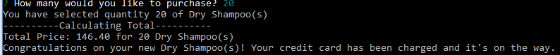 

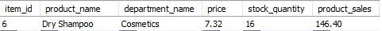 

## **BAMazon Manager**

As the manager the user has the ability to view the products which are currently for sale in the app, view the items with inventory levels below five remaining, add inventory to the warehouse as well as add a new product. 

When the user starts the app they are prompted with the choices that were detailed above. The manager app will always return to the menu whenever they are done with the task they were doing. By selecting **disconnect** it will end the app. 

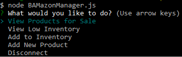 

### **Products for Sale**

In selecting View Products for Sale the user will have the same display as the customer app. 

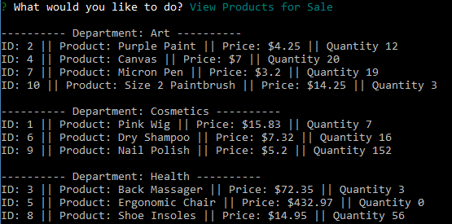 

### **View Low Inventory**

After selecting View Low Inventory, it will run the same process as view products for sale, but only display items with a quantity of less than five. After displaying all the low inventory items, it will prompt the user if they would like to restock an item. This goes to the same process as Add to Inventory from the menu. 

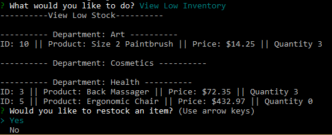 

### **Restocking / Add to Inventory**

In selecting Add to Inventory or selecting Yes after viewing low inventory the program prompts the user for the ID number of the item to restock. This goes through the same validation process as the customer requesting to purchase an item. The ID must be a number and must be an ID that is currently being used by a product. 

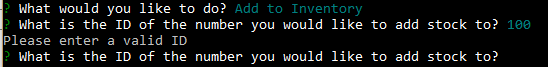 

When a valid ID was input, it will prompt the user with the name of the item they are looking to restock to ensure it's the correct item they wanted to select. The app will also request how many the user would like to restock. The data will be validated to ensure the amount is a number and is over 0. 

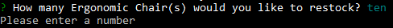 

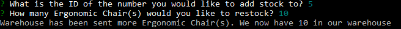 

After restocking was successful, this communicates to the database and updates the amount in the database with the amount that was restocked. 

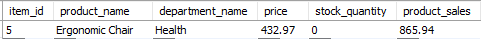 

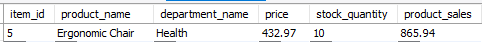 

### **Add New Product**

When the user selects Add New Product they are first prompted with the name of the new item to be added to the app. The name contains no validation. However, it is limited to 255 characters as that is the limit in the database. 

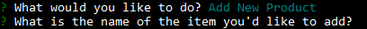 

After entering the name of the item, the prompt will request the user to assign the item to a department. As of now, these are hard coded into a list to prevent typo's, blank entries and other variance which would skew the display for the customer. In a future update this will be dynamic with the addition of new departments from the supervisor app. 

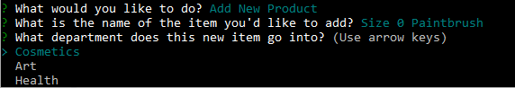 

Once a name and a department has been entered for the new item the user will be prompted for a price. This, again, follows the validation above with restocking where the entered amount must be a number. The database can take any number up to $99,999,999.99. Any additional places after the decimal will be dropped. 

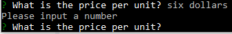 

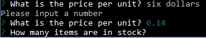 

Lastly, the app will ask the user how many items are currently in stock. As above, this requires a number. The stock amount must be an integer, any decimal values will be dropped. 

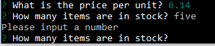 

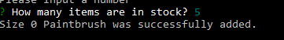 

This will then update the database with the information that the manager provided. It will then be immediately available for purchase from the customer app.

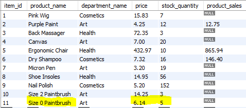 

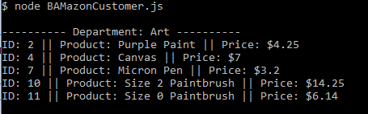 

## **BAMazon Supervisor**

On startup the supervisor app has the three options that were detailed above. The supervisor app gives the user the ability to see the sales by each department and if each department is profitable or not. As with the manager app, when a process is completed the app loops back to the menu where there the user can disconnect. By selecting **disconnect** it will end the app. 

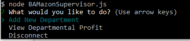 

### **Add New Department**

When running Add New Department the first prompt is asking for the department's name; this has no validation. However, there is a limit of 255 characters as that is what the database can hold. 

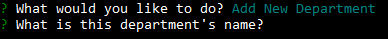 

Next, the user must enter the new department's overhead costs. This will be used in the profit formula in the view sales portion. As with the other apps where users were prompted to input numbers, this contains validation that the input is a number. The database can take any number up to $99,999,999.99. Any additional places after the decimal will be dropped. 

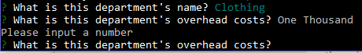 

After the name and the amount of overhead the department has been entered a success message will pop up along with a note to contact technology. The message to contact technology is due to the hardcoded values department values in this and the other apps. For example, the manager app will not be able to add new products to the department just added. This will come in a future update.

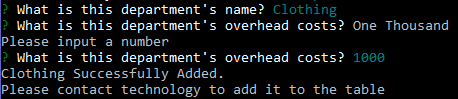 

### **View Departmental Profit**

In selecting View Departmental Profit, the user will be shown all departments which have been entered into the system. As mentioned above, these are currently hardcoded and the code must be updated when new departments are added to the system. 

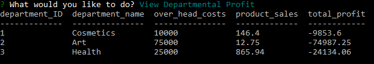 

The values are all driven from the database with the execption of total_profit. That is calculated by taking over_head_costs and subtracting it from product_sales. 

The Departmental Profit table is populated with department objects which are made using a constructor when View Departmental Profit is selected. The app takes the data from the departments table, creates an object with it, then iterates through the products table and sums up the sales from each of the items related to the department and attaches it to the department's object.  

### **Reflection**

This assignment was difficult at times, yet rewarding when completed. Integrating mySQL with Node and working within the command line posed problems, but taking it in small chunks made the process manageable. 

When I return to this assignment I would like to make the app scalable with adding departments in the supervisor app and having the manager and customer app able to view the addition.